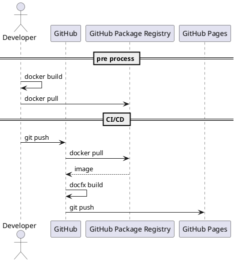

# DocFXを使用したドキュメントの作成
DocFXを使用したドキュメントの作成方法について記載する。

# 環境構築

## Windows PC
- [.NET Core SDK 3.1](https://dotnet.microsoft.com/download/dotnet-core/3.1)
  - dotnet CLIを使用するために必要

- [Build Tools for Visual Studio 2019](https://visualstudio.microsoft.com/ja/downloads/)
  - DocFXのビルドに必要
  - 起動後に以下のコンポーネントをインストール
    - .NET Core 3.1 LTS ランタイム
    - .NET Core SDK

- [DocFX](https://dotnet.github.io/docfx/)
  - ドキュメントの作成に必要
  - windowsならchocoでインストールできる
    - PowerShellを管理者権限で起動して以下のコマンドでインストール
      
      ```bash
      choco install docfx -y
      ```

- [NuGet](https://www.nuget.org/downloads)
  - DocFXのプラグインをインストールするために必要

- [GraphViz](http://www.graphviz.org/download/)
  - DocFXのプラグインでPlant-umlの図を描画するために必要
  - windowsならchocoでインストールできる
    - PowerShellを管理者権限で起動して以下のコマンドでインストール

      ```bash
      choco install graphviz -y
      ```

- [Node.js](https://nodejs.org/ja/download/)
  - DocFXのビルドに必要

- [wkhtmltopdf](https://wkhtmltopdf.org/downloads.html)
  - ドキュメントのPDF化に必要
  - windowsならchocoでインストールできる
    - PowerShellを管理者権限で起動して以下のコマンドでインストール

      ```bash
      choco install wkhtmltopdf -y
      ```

## Dockerで環境構築

- 下記のDockerfileをビルドする。

  ```Dockerfile:Dockerfile
  FROM ubuntu:18.04
  ENV LANG ja_JP.UTF-8
  ENV PATH /docfx:${PATH}
  ENV DEBIAN_FRONTEND noninteractive
  ENV TZ Asia/Tokyo

  RUN apt-get update -y && \
      apt-get install -y --no-install-recommends \
          apt-transport-https \
          ca-certificates \
          dirmngr \
          fonts-ipafont \
          gnupg \
          libssl1.0-dev \
          nodejs \
          npm \
          nuget \
          wget \
          unzip

  RUN wget https://packages.microsoft.com/config/ubuntu/18.04/packages-microsoft-prod.deb -O packages-microsoft-prod.deb && \
      dpkg -i packages-microsoft-prod.deb && \
      apt-get update -y && \
      apt-get install -y --no-install-recommends \
          aspnetcore-runtime-3.1 \
          dotnet-sdk-3.1

  RUN export GNUPGHOME="$(mktemp -d)" && \
      gpg --batch --keyserver hkp://keyserver.ubuntu.com:80 --recv-keys 3FA7E0328081BFF6A14DA29AA6A19B38D3D831EF && \
      gpg --batch --export --armor 3FA7E0328081BFF6A14DA29AA6A19B38D3D831EF > /etc/apt/trusted.gpg.d/mono.gpg.asc && \
      gpgconf --kill all && \
      rm -rf "$GNUPGHOME" && \
      apt-key list | grep Xamarin && \
      echo "deb https://download.mono-project.com/repo/ubuntu stable-bionic main" | tee /etc/apt/sources.list.d/mono-official-stable.list && \
      apt-get update -y && \
      apt-get install -y --no-install-recommends \
          mono-complete \
          mono-runtime && \
      apt-get update -y && \
      apt-get upgrade -y

  RUN wget https://github.com/wkhtmltopdf/wkhtmltopdf/releases/download/0.12.5/wkhtmltox_0.12.5-1.bionic_amd64.deb && \
      apt-get install -y ./wkhtmltox_0.12.5-1.bionic_amd64.deb && \
      rm ./wkhtmltox_0.12.5-1.bionic_amd64.deb

  RUN npm install -g npm && \
      npm cache clean && \
      npm install n -g && \
      n stable && \
      ln -sf /usr/local/bin/node /usr/bin/node

  ADD https://github.com/dotnet/docfx/releases/download/v2.49/docfx.zip /
  RUN unzip /docfx.zip -d /docfx && \
      rm /docfx.zip
  ADD entrypoint.sh /usr/local/bin/docfx
  RUN chmod 777 /usr/local/bin/docfx && \
      chmod 777 /docfx/docfx.exe && \
      rm -rf /var/lib/apt/lists/* /tmp/*

  WORKDIR /work
  ```
  ```bash:entrypoint.sh
  #!/bin/bash

  mono "/docfx/docfx.exe" "$@"
  ```

- 作成した環境にファイルをマウントして利用する。

  ```bash
  docker run --rm -it -v /`pwd`:/work <image名> bash
  ```

# ドキュメントの作成

## DocFXのファイルの説明
- docfx.json
  - DocFXで使用するファイルや設定を定義している
- index.md
  - 初期画面
- toc.yml
  - WEBページの構成を定義する
- pdf/toc.yml
  - PDFの構成を定義している
- pdf/cover.yml
  - PDFのカバーページ
- **/.md
  - 各ページ
- template/*
  - デザインなどを定義している資材が格納されている
- **/*.json
  - REST APIの仕様をSwaggerのJSON形式で定義している

## ドキュメントの作成手順
1. ディレクトリの移動

  ```bash
  cd <docfx.jsonが存在するディレクトリ>
  ```

2. ソースコードコメントのyml化
  ```bash
  docfx metdata
  ```

3. プラグインのインストール
  ```bash
  nuget install DocFx.Plugins.PlantUml -ExcludeVersion -OutputDirectory .
  ```

4. ドキュメントのPDF化
  ```bash
  docfx pdf
  ```
  _site_pdfフォルダにPDFが作成される。

5. ビルド
  ```bash
  docfx build
  ```
  _siteフォルダににhtml等が展開される

6. ウェブページのホスティング
  ```bash
  docfx serve _site -n "*" -p 8080
  ```
  ブラウザでlocalhost:8080にアクセスしてドキュメントを確認できる<br>
  Windowsの場合、4と5は以下のコマンドでまとめて実施できる
  ```bash
  docfx --serve
  ```

# 課題
- WindowsだとPDFのフォントが汚い
  - フォントをインストールすれば、どうにかなりそう。

- WindowsだとPDFに画像が貼れない
  - PDFにすると画像が消える。

- noteやwarningなどがPDFで崩れる
  - ボックスが崩れる

- Dockerfileが大きい

# CIへの組み込み
GitHub Actionsで環境を構築するのはインストールするものが多くて難しいので、GitHub Actions上でDockerを使用する必要がある。<br>
しかし、上に記載したDockerfileはビルドに約10分ほどかかり、毎回ビルドするのは避けたい。<br>
そこで、事前にGitHub Package RegistryにビルドしたイメージをPushしておき、GitHub Actions上でそのイメージをpullして利用する。



# 参考文献
[DocFX Getting Started](https://dotnet.github.io/docfx/tutorial/docfx_getting_started.html)